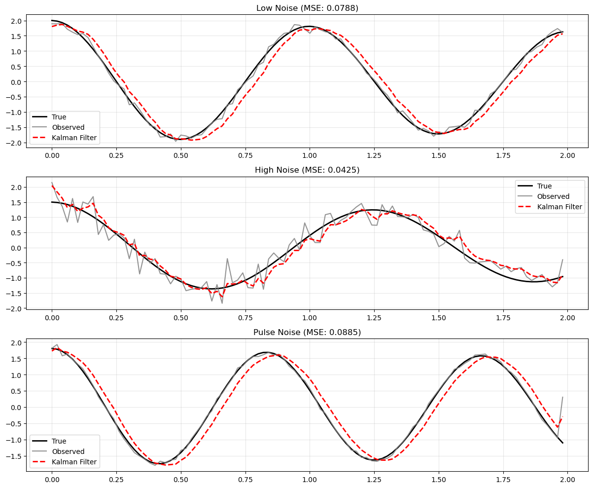

# Kalman Filter

In this implementation, I try to generalize the Kalman function for higher dimensional estimations. 
This results in some offset behavior, but ultimately the dynamic process is able to model the data effectively. 

## What is the Kalman Filter?

**The Math:**
```
State:        x_{k+1} = F*x_k + w_k
Observation:  z_k = H*x_k + v_k
Predict:      x̂_k = F*x̂_{k-1}
Update:       x̂_k = x̂_k + K*(z_k - H*x̂_k)
```

**In Words:**
The Kalman filter is an optimal estimator that predicts the next state of a system, then corrects that prediction using noisy measurements. 
Essentially, it models the noisy observations then applies corrective predictions to the observations.

## What Can It Do?

- Track moving objects (GPS, radar, robotics)
- Estimate hidden states from noisy sensors
- Predict future values in time series
- Filter out noise while preserving signal

## Results



1. **Low Noise**: Clean signal with small errors
2. **High Noise**: Clean signal with large errors  
3. **Pulse Noise**: Signal with random spikes

The filter successfully tracks the true signal regardless of noise with a 4-9% margin of error in these experiments.
Importantly, there appears to be an offset in the prediction for the Kalman filter when noise is low or pulsed.
This is likely due to the abstracted implementation process for the Kalman filter, regardless it remains close but offset.

## Conclusion

The Kalman filter provides optimal state estimation for linear systems.
I encourage understanding this algorithm and its implications deeply, check references for resources.


## Citation

If you use this code in your research, please cite:

```bibtex
@software{pjm2025KF,
  author = {Paul J. Mello},
  title = {Kalman Filter},
  url = {https://github.com/pauljmello/Kalman-Filter},
  year = {2025},
}
```

## References

Kalman, R.E. (1960). "A New Approach to Linear Filtering and Prediction Problems." *Journal of Basic Engineering*, 82(1), 35-45.

Wikipedia contributors. (2024, May 20). *Kalman filter*. Wikipedia. [https://en.wikipedia.org/wiki/Kalman\_filter](https://en.wikipedia.org/wiki/Kalman_filter)

Stanford University. (n.d.). *Kalman Filtering Lecture Notes* \[PDF]. EE363: Linear Dynamical Systems. [https://web.stanford.edu/class/ee363/lectures/kf.pdf](https://web.stanford.edu/class/ee363/lectures/kf.pdf)
